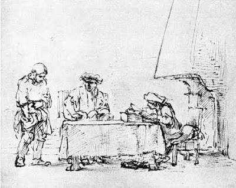

# minas

So he called ten of his servants and gave them ten minas. ‘Put this money to work,’ he said, ‘until I come back.’   - Luke 19:11

# Types of indicators

"A perfection of means, and confusion of aims, seems to be our main problem.""   - Einstein

1. Trend

    These technical indicators measure the direction of a trend by comparing prices to an established baseline. Direction but not strength.

    - Moving averages (MA)
    - Parabolic stop and reverse (PSAR): Used to find potential reversals in the market price direction.
    - Moving Average Convergence Divergence (MACD): Used to reveal changes in the strength, direction, momentum, and duration of a trend in a stock’s price.

2. Momentum

    These technical indicators may identify the speed of price movement by comparing the current closing price to previous closes. Strength and not direction. 

    - Stochastic Oscillator: Used to predict price turning points by comparing the closing price to its price range.
    - Commodity Channel Index (CCI): An oscillator that helps identify price reversals, price extremes, and trend strength.
    - Relative Strength Index (RSI): Measures recent trading strength, velocity of change in the trend, and magnitude of the move.

3. Volatility

    These technical indicators measure the rate of price movement, regardless of direction.

    - Bollinger bands: Measures the “highness” or “lowness” of price, relative to previous trades.
    - Average True Range: Shows the degree of price volatility.
    - Standard Deviation: Used to measure expected risk and to determine the significance of certain price movements.
    - measures risk rising, or risk dropping

4. volume
    
    These technical indicators measure the strength of a trend based on volume of shares traded.
    
    - Chaikin Oscillator: Monitors the flow of money in and out of the market, which can help determine tops and bottoms.
    - On-Balance Volume (OBV): Attempts to measure level of accumulation or distribution, by comparing volume to price.
    - Volume Rate of Change: Highlights increases in volume. These normally happen mostly at market tops, bottoms, or breakouts.

5. Money Flow

    - is stock being accumulated or distributed
    - https://www.investors.com/how-to-invest/investors-corner/tracking-distribution-days-a-crucial-habit/

6. Sentiment

    - too fearful?  too euphoric?
    - twitter
    - Natural Language Toolkit - http://www.nltk.org/
    - Examples:
        - https://www.twilio.com/blog/2017/09/sentiment-analysis-python-messy-data-nltk.html
        - https://towardsdatascience.com/machine-learning-nlp-text-classification-using-scikit-learn-python-and-nltk-c52b92a7c73a
        - https://github.com/search?q=nltk+twitter

7. Breadth

    - healthy move or unhealthy move

## References

1. http://www.visualcapitalist.com/12-types-technical-indicators-stocks/

# Candle stick patterns

### Links

http://thepatternsite.com/CandleEntry.html

https://www.candlestickforum.com/PPF/Parameters/16_263_/candlestick.asp

# Statistics Resources

https://www.quantopian.com/lectures

https://camdavidsonpilon.github.io/Probabilistic-Programming-and-Bayesian-Methods-for-Hackers/

## Thinkscript 

Docs:

  - http://tlc.thinkorswim.com/center/howToTos

Links:

  - [Chat Log summaries](thinkscript/chat_log_summaries.txt)

  - JohnnyQuotron:
      - OneNote: https://1drv.ms/u/s!AnkeHrrRM_cvgxQTl1xckINYlKhZ

  - DMonkey:
      - Mytrade: https://mytrade.com/profile/DMonkey/statuses/9825468

  - StanL:
      - Onenote: https://onedrive.live.com/view.aspx?resid=186A54BC7E98AF81!114&app=OneNote&authkey=!AM6a5se-lH2yutg
      - PDF to Markdown of snippet collection: https://github.com/jshingler/TOS-and-Thinkscript-Snippet-Collection/

  - Mobius 
      - Squarespace: http://rr-corner.squarespace.com/mobius-cave/2012/9/27/mobius-wave-squeeze.html

# Hall of Fame

    James Simons
    David Swensen
    Louis Bacon
    Steven Cohen
    Kenneth Griffin
    Paul Tudor Jones
    George Soros
    Michael Steinhardt
    Jack Nash
    Seth Klarman
    Alfred Jones
    Leon Levy
    Julian Roberston
    Bruce Kovner

# Pairs Trading

### References

https://en.wikipedia.org/wiki/Autocorrelation

https://www.quantopian.com/lectures
  - https://www.quantopian.com/lectures/linear-correlation-analysis
  - https://www.quantopian.com/lectures/p-hacking-and-multiple-comparisons-bias
  - https://www.quantopian.com/lectures/introduction-to-pairs-trading
  - https://www.quantopian.com/lectures/integration-cointegration-and-stationarity

### Other references

https://stockcharts.com/school/doku.php?id=chart_school:trading_strategies

https://www.reddit.com/r/thewallstreet/comments/7yapsu/a_trendfollowing_overlayindicator_i_created_for/

https://www.investopedia.com/trading/continuation-patterns-introduction/

--------------------

